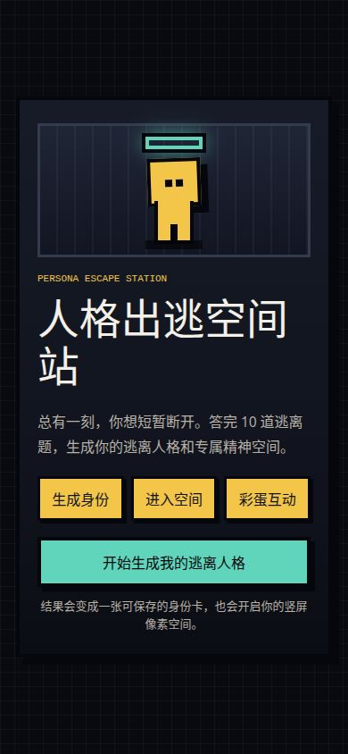
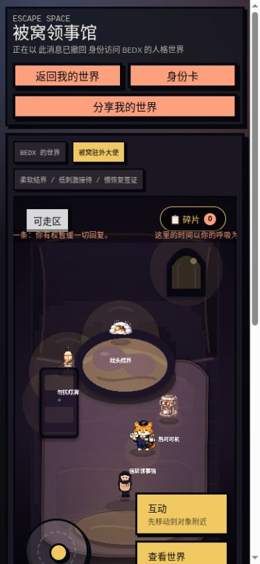

# 人格出逃空间站

`人格出逃空间站 / Personality Escape Station` 是一个移动端优先的人格测试与竖屏像素空间项目：用户完成 10 题测试，生成可分享的像素身份卡，再进入一个 9:16 的人格空间，里面包含地图、主角、道具、互动 Agent、人格碎片和串门链接。

本项目基于 MIT License 的 WorldX 改造，但当前已经不再是旧 WorldX 前端或 demo-world 运行时。项目保留了 WorldX 中有价值的生成底座，并围绕「人格出逃空间站」重建产品体验。

## 产品来源

本项目的产品构思，以及前期问卷构建，主要由抖音 AI 创变者计划海淀二站「人生再活一次」团队共同构思完成。本仓库在此基础上，将问卷、人格结果、竖屏空间、可复用生成资产与 Agent 互动整合为可运行的开源产品原型。

## 当前状态

- 产品名：`人格出逃空间站 / Personality Escape Station`。
- 推荐 GitHub 仓库名：`personality-escape-station`。
- 固定 MVP 模式已落地：固定问卷结果 -> 12 套可复用人格空间。
- 固定资产库位于 `client/public/personality-assets/fixed`。
- 生成后的固定资产会有意保留在仓库中，因此固定 MVP 不需要重新调用生图 API 也能运行。
- 当前 12 个人格都已经有 `manifest.json`、竖屏地图、TMJ 碰撞、可走区、主角帧、道具图和 Agent 图。
- 地图使用确定性的 `composite-v1`：AI 不负责碰撞、可走区或热点可达性。
- 主角帧在 MVP 中支持程序化 8 方向 fallback，避免图片模型生成 8x8 sheet 时贴边、跨格、裁切导致不可用。
- 未来模式：根据每个用户的问卷结果和一句补充描述，实时生成独立空间变体。

## 产品路由

- `/`：产品首页。
- `/quiz`：10 题人格出逃测试。
- `/result`：人格身份卡与分享图。
- `/space`：当前用户的人格空间。
- `/space?visit=<archetypeId>&owner=<name>`：访客串门。

## 玩法简介

1. 回答 10 道短题，获得 12 种人格原型之一。
2. 生成一张可保存、可分享的像素人格身份卡。
3. 进入竖屏人格空间，操控 8 方向移动的主角探索房间。
4. 靠近道具或 Agent 触发短互动，解锁人格碎片。
5. 分享串门链接，让其他玩家访问你的人格空间。

## 运行截图

以下截图来自本地实际运行页面 `http://localhost:3200`。

<p align="center">
  
  
</p>

## 固定资产库

固定资产会保留在前端 public 目录，运行时直接通过 manifest 加载：

```text
client/public/personality-assets/fixed/<archetype>/
  manifest.json
  room-design.json
  system-prompt.md
  map/background.png
  map/map.tmj
  map/walkable-grid.json
  map/navigation-template.png
  map/room-layout.json
  map/style-pack.json
  player/frames/frame_000.png ... frame_063.png
  player/frames/metadata.json
  player/prompt.md
  agents/<agentId>/image.png
  agents/<agentId>/metadata.json
  agents/<agentId>/prompt.md
  agents/<agentId>/system-prompt.md
  props/<propId>/image.png
  props/<propId>/metadata.json
  props/<propId>/prompt.md
```

人格 ID：

```text
BEDX GONE SIDE SPRK F1SH NOCT UNDO MUT8 BUFR JANK FINE GL1T
```

## 快速开始

```bash
npm install
npm run dev
```

打开：

```text
http://localhost:3200
```

开发脚本会启动：

- 前端：`http://localhost:3200`
- 服务端：`http://localhost:3100`

停止开发服务：

```bash
npm run stop
```

固定问卷、身份卡和人格空间浏览不需要模型 Key。生成资产和 Agent 聊天需要本地 `.env` 模型配置。真实 API Key 不应提交到仓库。

## 资产生成

推荐使用产品级统一命令：

```bash
npm run assets:generate
```

常用变体：

```bash
npm run assets:generate -- --all --dry-run
npm run assets:generate -- --archetype BEDX
npm run assets:generate -- --all --only map --force
npm run assets:generate -- --all --skip-player --skip-verify
npm run assets:generate -- --all --only player --force --procedural-player
npm run assets:generate -- --archetype JANK --only hotspot:jank-magnifier --force
```

说明：

- 生成过程可续跑；已完成资产默认复用，只有加 `--force` 才会强制重生。
- `--dry-run` 只生成 prompt 和 manifest 草稿，不调用图片 API。
- `--skip-player` 适合图片模型不稳定时，先生成地图、道具和 Agent。
- `--procedural-player` 会跳过图片 API，生成确定性的 8 方向主角帧。
- 旧的 whole-image 地图生图管线仍保留用于实验；固定人格空间默认使用 `composite-v1`。

## 校验命令

```bash
npm run verify:personality
npm run verify:fixed-assets:strict
npm run typecheck:client
cd server && npm run typecheck
cd client && npm run build
```

`verify:fixed-assets:strict` 会检查所有固定 manifest、地图尺寸、TMJ 碰撞、可走区拓扑、热点可达性、主角帧元数据、道具图和 Agent 图。

## 服务端接口

- `POST /api/personality/score`
- `POST /api/personality/rooms`
- `GET /api/personality/rooms/:roomId`
- `POST /api/personality/rooms/:roomId/events`
- `PATCH /api/personality/rooms/:roomId/events/:eventId`
- `POST /api/personality/dialogue`

房间事件类型：`gift`、`light`、`message`、`fragment`。

Agent 聊天在配置后使用 OpenAI-compatible chat endpoint。返回内容会先清洗再展示，移除 `<think>` 等推理标签，并限制回复长度。

## 项目结构

```text
client/src/personality/        H5 产品源码
client/public/personality-assets/fixed/
                               12 套固定人格空间资产库
server/src/                    Express API 与 SQLite 持久化
generators/personality/        固定人格资产生成管线
generators/map/                保留的地图生成实验能力
generators/character/          保留的角色/道具图片生成能力
scripts/generate-assets.mjs    产品级统一资产生成命令
```

## License

MIT。本项目基于 MIT License 的 WorldX 改造，保留 [LICENSE](./LICENSE)。
